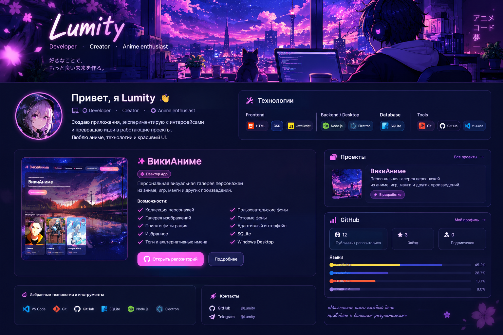
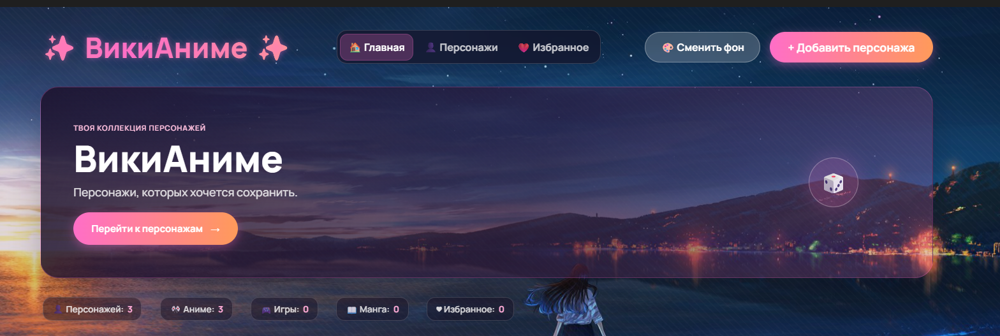

  

 

<h1 align="center">
  Привет, я Lumity 👋
</h1>

  <b>Developer · Creator · Anime enthusiast</b>

  Создаю приложения, экспериментирую с интерфейсами 
  и превращаю идеи в работающие проекты.

 

---

## 👨‍💻 Обо мне

<table>
<tr>

<td width="68%" valign="top">

### Lumity

Разрабатываю приложения с упором на удобство, визуальную составляющую и практичность.

Мне нравится сочетать программирование, UI/UX и аниме-эстетику, превращая идеи в полноценные проекты.

### 🎯 Интересы

- 🎨 UI/UX и красивые интерфейсы
- 💻 Desktop-разработка
- 🗃️ Базы данных
- 🎴 Anime / Manga / Games
- ⚡ Эксперименты с технологиями
- 🧩 Создание собственных приложений

 

  

  

  

</td>

<td width="32%" align="center">

# 🎴 ВикиАниме

  

  <b>Персональная визуальная галерея персонажей</b>
   
  из аниме, игр, манги и других произведений.

 

### ✨ Возможности

<table>
<tr>
<td width="50%" valign="top">

👥 **Коллекция персонажей**

🖼️ **Галерея изображений**

🔎 **Поиск и фильтрация**

❤️ **Избранное**

🏷️ **Теги и альтернативные имена**

</td>

<td width="50%" valign="top">

🎨 **Пользовательские фоны**

📱 **Адаптивный интерфейс**

🗃️ **SQLite**

🪟 **Windows Desktop**

🖼️ **Несколько изображений персонажа**

</td>
</tr>
</table>

